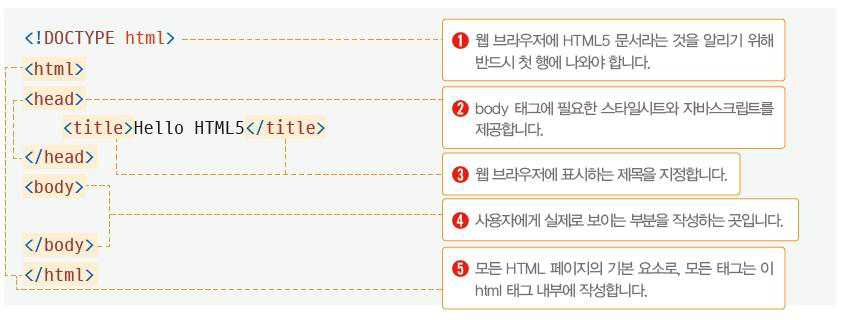
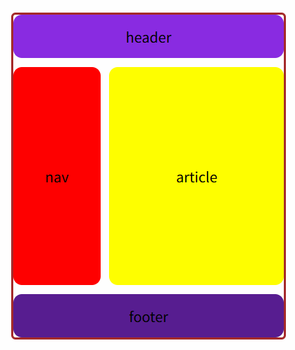

# 1. HTML

## 목차

1. HTML 문서 구조

## 1. HTML 문서 구조

\<html>태그 : 모든 HTML 문서의 기본 요소. 모든 태그는 html태그 내부에 작성

\<head>태그 : 웹 페이지에 필요한 파일들을 로딩하거나 정보를 설정

- \<meta> : 웹 페이지에 대한 추가 정보들을 전달
- \<title>: 페이지의 제목
- \<script>: 웹 페이지에 스크립트 추가
- \<style>: 웹 페이지에 스타일 시트 추가
- \<link>: 웹 페이지에 외부 파일 불러와 적용

 

\<body>태그: 사용자에게 보여지는 부분

## 2. HTML 기본 태그

- 제목 태그 : h1, h2 ..
- 글자 태그 : p ..
- 앵커 태그 : a
- 리스트 태그 : ul, ol, li
- 테이블 태그 : table, tr, th, td
- 미디어 태그 : img, video, audio
- 입력 양식 태그 : form, input, select, radio,textarea
- 공간분할 태그 : div, span

## 3. 문서 구조화(Semantic Tag)

- 블럭형 태그(div) / 인라인 태그(span)
- 시멘틱 태그: 시멘틱 웹이 의미를 인식하는 태그
  - 검색엔진이 페이지를 분석할때 가중치에 차이가 있음
  - 

## 3. 검색엔진 최적화(SEO)

검색엔진?
:웹에서 원하는 정보를 찾는데 걸리는 시간을 최소화하기 위해 사용되는 시스템

bot, 크롤러
: 사용자가 검색했을때 원하는 결과를 빠르게 보여주기 위해 정보를 미리 데이터베이스화 시키는 프로그램

**검색엔진 최적화(SEO)란?**
: 검색이 잘 되도록 설계하는 것

HTML로 SEO 하는 2가지 방법

1. meta 태그: 검색엔진에 정보를 제공할 목적인 태그
2. semantic 태그: 웹페이지 구조를 구성하는 태그
   - \<header>, \<nav>, \<section>, \<article>, \<aside>, \<footer>
