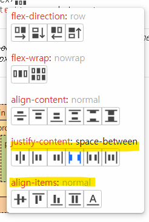
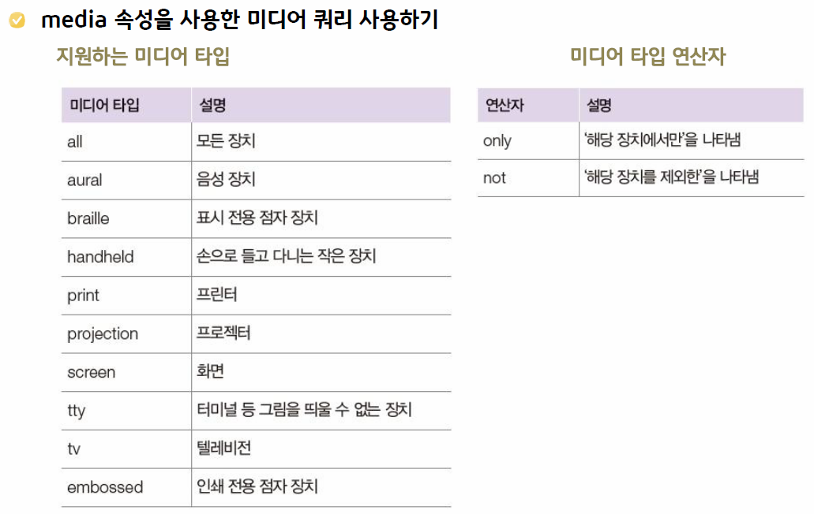

# 2.CSS

## 목차

1. CSS가 왜 필요한가?
2. CSS 적용
3. 선택자(selector)
4. CSS Unit
5. CSS 핵심 속성
6. 레이아웃 구성(FlexBox)
7. 반응형 웹

## 1. CSS가 왜 필요한가?

CSS란? Cascading Style Sheets의 약자

- HTML - 정보를 표현하는 역할. 구조를 담당
- CSS - HTML문서를 시각적으로 꾸미는 역할.
- JavaScript - 정적인 HTML 문서에 동적인 행위를 부여하는 역할. 실질적 작동.

=> 가독성과 코드관리의 효율을 높이고, 재사용성과 독립성 보장

## 2. CSS의 적용

html문서 head태그 안에서

```
 1. style 태그 안에
  <style>
      p(선택자) {
        color: blue;(속성)
      }
  </style>

  2. 외부 css파일 적용
  <link rel="stylesheet" href="style.css" />
```

ps. p라는 클래스의 color속성(변수)를 변경(메소드)한는 개념

## 3. 선택자(Selector)

HTML에 스타일을 적용할 때 HTML요소를 선택하는 역할

- 전체 선택자: \*
- 유형 선택자: h1, p, img ...
- 아이디 선택자: #, 단일선택
- 클래스 선택자: ., 복수선택
- 복합선택자: h1 p, ul > li, 태그 서로의 관계와 위치를 이용하여 선택
- 반응 선택자: :hover, :active
- 상태 선택자: :checkd, :focus, :disabled
- 구조 선택자: :first-child, :last-child, :nth-child
- 가상 선택자: ':', '::after'

## 4. CSS Unit

### 절대값 - px

- 절대값 지정

### 상대값 - %, em, rem

- 상대값 지정
- 반응형 웹 작성시 상대값 사용을 권장. (폰트 크기는 rem(em), 길이는 % 사용)
- em: 기준값에서 배수, %: 백분율 기준
- 상대값의 기준은 부모 또는 선택자에 의해 정한 경우 그 기준
- rem: root em root, 즉 최상위 엘리먼트에서 지정된 font-size의 값을 기준(default:16px)

```
body {
  font-size: 62.5%; /_ font-size 1em = 10px 브라우저의 기본 설정 _/
}
span {
  font-size: 1.6em; /_ 1.6em = 16px _/
}
```

하지만 rem과 em도 용도에 맞게 적절히 혼용해서 사용하는 것이 좋다.
예를 들어 어느 페이지에서든 고정된 사이즈를 사용해야 한다면 rem을,
부모 요소에 따라 유동적으로 변해야 하는 곳에는 em을 사용하면 된다.
그래서 보통 font-size에는 rem을 사용하고 padding이나 margin같이
화면에 따라 유연하게 변하는 크기는 em이나 %를 사용한다.

> ❗px 사용의 문제점
>
> - 모든 브라우저는 사용자가 font-size를 변경 할 수 있다. (따로 font-size를 지정하지 않으면 일반적으로 16px)
> - 개발자가 만약 font-size를 px로 고정하면, 사용자가 브라우저 설정에서 font-size를 변경하려고 해도 변경이 되지 않는다.
> - 예를 들어 css에서 font-size를 24px로 설정해두고 브라우저에서 사용자가 font-size를 40px로 바꾸려고 해도 화면에 표시되는 크기는 24px에서 변하지 않는다. 한마디로 px은 사용자의 설정값을 덮어쓴다는 뜻이다.

## 5. CSS 핵심 속성

- 참고하기 좋은 사이트: [MDN](https://developer.mozilla.org/en-US/docs/Web/CSS/Reference/Properties/font-size)

### 5.1 배치(position)속성

#### 배치(position) 속성이란?

배치속성의 종류: block, inline

```
- none: 화면에 보이지 않음(영역차지x)
- block: 블록박스 형식. 요소가 있는 줄 전체를 차지
- inline: 인라인 박스 형식. 요소가 있는 공간만을 차지
- inline-block: 블록과 인라인 중간형태. width, height 적용가능한 inline
```

블록과 인라인이라는 개념은 왜 존재할까? ---> 요소를 보기좋게 배치하기 위해서

요소를 배치 하는 3가지 방법

- block
- inline
- box model : 기본적으로 모든 HTML요소를 감싸는 상자.
  - element, padding, border, margin

#### position

position : {absolute|fixed|relative|static(default)}

- absolute: 왼쪽 상단을 기준(0,0)으로 절대 위치. 상위 요소중에 relative가 있다면 그 안에서 절대적위치로 적용됨
- fixed: 절대위치 고정
- relative: 부모요소로 부터 '자기자신'을 기준으로 지정한 위치만큼 이동
- static: 요소 기본 순서대로

**위치 지정 -** left, right, top, bottom: 위치 값 지정

**overflow - {hidden}** : scroll 설정

**float - {left, right}** : 요소가 전체 레이아웃에서 폭은 차지하지 않고 높이만 차지함

### 5.2 font

- 폰트 크기 지정 속성: font-size
- 정렬 속성 : text-align: left|right
- 폰트 지정: font-family: os기본폰트, 웹폰트 지정

## 6. 레이아웃 구성(FlexBox)

### FlexBox

**FlexBox란?**  
UI 디자인에 최적화된 레이아웃을 정의하는 CSS.

- 웹 페이지의 **주축(가로/세로)**을 기준으로 정렬하여 레이아웃을 구성하는 방식으로, colunm단위로 요소를 인식한다.
- 부모를 기준으로 자식 요소를 원하는 방향으로 유연하게 배치하기에 용이하다.

❗**FlexBox 제 1원칙**: 부모에만 정의할 수 있다. 부모자식관계를 파악한 후 부모에 적용해야 자식이 영향을 받음.

**사용방법**

<code>(부모요소){ display:flex; }</code>

1. 공간에 맞추기: <code>dispaly:flex;</code>
2. 주축 정렬: <code>justify-content</code>속성.
3. 교차축 정렬: <code>align-items</code>속성.
4. 축 방향 변경: <code>flex-direction</code>속성 - row(가로)|colunm(세로)|-reverse(역방향)

==> flexBox는 기본적으로 두 축을 기준으로 움직이기 때문에, 축 방향을 기준으로 요소를 움직이는 여러 속성이있다.



## 7. 반응형 웹

다양한 디바이스(화면크기)에 맞춰 자동으로 요소를 배치하는 웹 페이지

- media query 사용해 설정
- viewport meta 태그 일부만
- pc에서는 적용 x

**적용방법**

1. @-규칙: 스타일 시트내부에서 작성

```
@media (<미디어 쿼리 >) {
  <CSS코드>
}
```

2. meadia 속성: 해당 미디어 쿼리 조건에 맞는 파일을 불러옴

```
<link rel ="stylesheet" href="파일 이름" media="미디어 쿼리" >
```

**미디어 타입**


**미디어 속성**

width: (화면 너비)

```
/* 스마트폰
@media screen and (max-width: 767px) {
  body {
    background-color: red; }
  }
/*태블릿 PC */
@media screen and (min-width: 768px) and (max-width: 959px) {
  body {
    background-color: green;
  }
}
/*데스크톱 */
@media screen and (min-width: 960px) {
  body {
    background-color: blue;
  }
}
```

orientation: (장치 방향, portrait|landscape)

```
<!-- 가로 -->
  @media screen and (orientation: portrait) {
    body {
      background-color: red;
    }
  }
<!-- 세로 -->
  @media screen and (orientation: landscape) {
    body {
      background-color: green;
    }
  }

```
