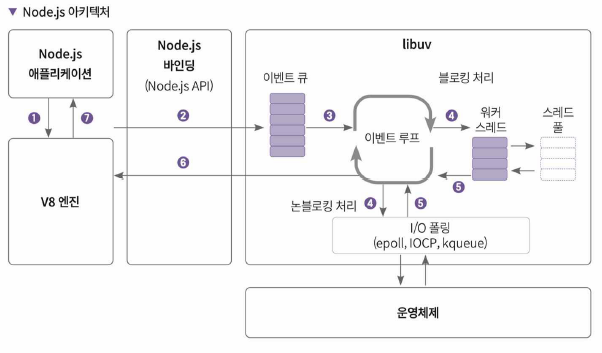

# Node.Js

## 목차

1. Node.js란
2. npm
3. 모듈

## 1.Node.js

Node.js란? 서버측 자바스크립트 런타임 환경이다.

브라우저 밖에서 js를 사용하는 V8엔진을 사용한다.
**논블로킹/비동기 처리** API를 제공하는 것이 가장 큰 특징(싱글스레드)
-> 노드를 쓰는 이유

엔진: 사용자가 작성한 코드를 실행하는 프로그램

parser, compiler, interpreter, ...

## 기술적 특징

#### 비동기 처리

자바스크립트는 노드환경에서 싱글스레드이지만 라이브러리를 활용해서 비동기 처리가 가능하다.

- async/await, promise ...

#### 이벤트 기반 아키텍쳐

Node.js에서 자바스크립트에 없는 HTTP,File,소켓,I/O 등의 기능은 어떻게 제공하는가?
-> libuv 라이브러리를 통해 제공

_libuv: 이벤트 루프와 운영체제 단 비동기 API 및 스레드 풀을 지원_

Node.js는 싱글스레드이지만, 이벤트 기반 아키텍처 도입으로 비동기 처리가 가능.

_싱글 스레드: 싱글스레드는 콜 스택이 하나라는 것. 한 번에 하나의 작업만 가능_

libuv의 이벤트 루프를 사용. 이벤트 기반 아키텍쳐에서 이벤트 루프는 필수!

<!-- 작동방식 설명 -->



## 2. npm

### 개념정리 - 모듈/패키지/라이브러리

- 모듈:
  - 프로그램을 기능별로 작은 단위로 쪼갠 것
  - 다른 곳에서 사용할 수 있도록 파일 형태로 저장
  - 다른 코드 안에서 특정 모듈을 가져와서 사용할 수 있음
- 패키지
  - 자주 사용하는 기능 모듈들을 묶어 놓은 것
  - 배포의 단위가 됨
- 라이브러리
  - 모듈보다 더 큰 단위

### npm(node package manager): 패키지 설치 매니저

#### 사용

프로젝트 단위로 초기화 필요

```shell
> npm init
...
package name: (src) # 모두 엔터치기
version: (1.0.0)
description:
entry point: (index.js)
test command:
git repository:
keywords:
author:
license: (ISC)
type: (commonjs)
About to write to C:\KB_workspace\4_NodeJs\src\package.json:

{
  "name": "src",
  "version": "1.0.0",
  "description": "",
  "main": "index.js",
  "scripts": {
    "test": "echo \"Error: no test specified\" && exit 1"
  },
  "author": "",
  "license": "ISC",
  "type": "commonjs"
}

```

결과: `package.json` 생성

#### 패키지 설치/삭제

```shell
npm i <패키지명> #설치

#package.json에서 설치된 것 확인
  "dependencies": {
    "ansi-colors": "^4.1.3"
  }


npm uninstall <패키지명> #삭제
```

## 3. 모듈

- 기능별로 만들어 놓은 함수
- "파일 형태"로 만들고, 사용함
- 자바스크립트 표준 모듈 시스템 : ES 모듈시스템, 노드 13.2 이후 버전부터 지원
- CommonsJs: require()함수 사용

### 내보내기/가져오기

#### export(내보내기):

```js
module.export = 내보낼 함수 또는 변수(1개) //default:{}
or
exports.(function)
```

단일 내보내기:

```js
// CommonJS
module.exports = hello = (name) => {
  console.log(`${name}님, 안녕하세요`);
};
// ESM
export default hello = () => {
  console.log(`${name}님, 안녕히가세요`);
};
```

여러개 내보내기:

```js
// CommonJS
module.export = { hello, bye };
// or
exports.hello = (name) => {
  console.log(`${name}님, 안녕하세요`);
};
exports.bye = (name) => {
  console.log(`${name}님, 안녕히가세요`);
};

// ESM
export const hello = (name) => {
  console.log(`${name}님, 안녕하세요`);
};
export const bye = (name) => {
  console.log(`${name}님, 안녕히가세요`);
};
```

#### import(가져오기):

```js
// CommonJS
const { hello, bye } = require('./hello');

// ESM
import { hello, bye } from './hello.js';
```

#### 모듈로 설정하기

- ESM 방식 : `package.json`에 설정 -`"type":"module"`
- ES와 CommmonJs를 혼용할 때: 파일 확장자를 .mjs로 지정(pacakage.json에 지정하면 안됨).

### 노드 핵심 모듈

- fs: 파일시스템
- http: HTTP 프로토콜
- path: 파일경로
- util: 유틸리티 함수
- streams: 데이터 스트림 처리

**글로벌 모듈**

- ${\_\_dirname}: 현재 모듈의 디렉토리 경로
- ${\_\_filename}: 현재 모듈의 파일 경로

### 모듈을 중복으로 호출하는 경우?

!! 노드에서 모듈은 cache로 운영됨

> - a.js 라는 모듈이 있고, import를 다른파일이든 한 파일에서든 여러번 import를 하더라도, 딱 한번만 호출 됨
> - import 구문을 만나면 module 캐시 테이블에 모듈을 등록함.
> - 또 같은 모듈을 import 하는 구문을 만나더라도 캐시에 등록되어있기 때문에 새로 호출하지 않음.

## 서버 만들어보기

```js
const http = require('http'); //http 객체 생성
const { setTimeout } = require('timers/promises');

let count = 0;

//노드 서버 객체
const server = http.createServer((req, res) => {
  console.log('my server');
  console.log((count += 1));

  res.statusCode = 200; //OK
  res.setHeader('ContentType', 'text/plain');
  res.write('hello\n');

  setTimeout(() => {
    res.end('Node.js');
  }, 2000);
});

server.listen(8000, () => console.log('listen')); //서버 실행 listen(포트번호)
```
